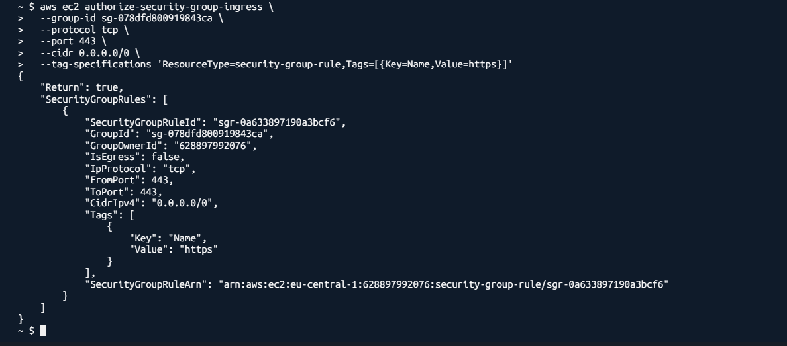
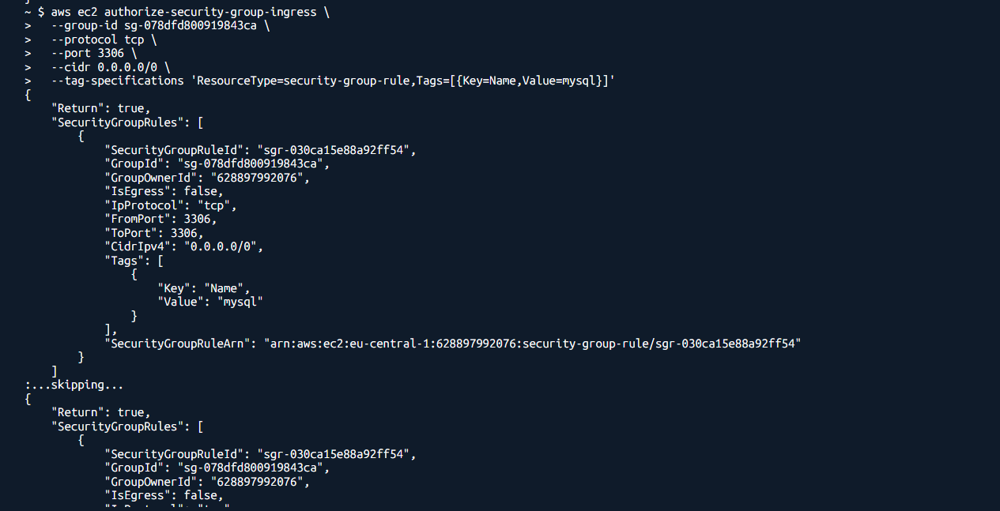
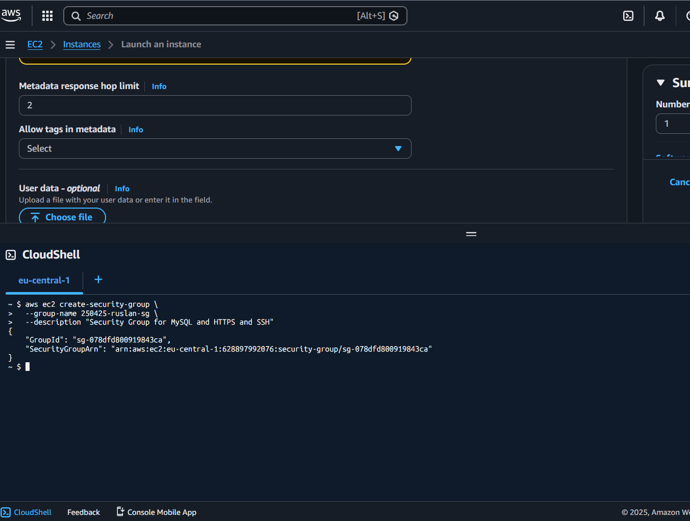
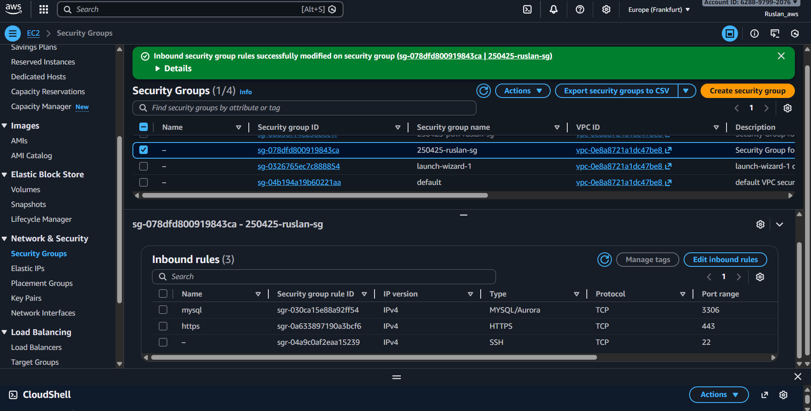
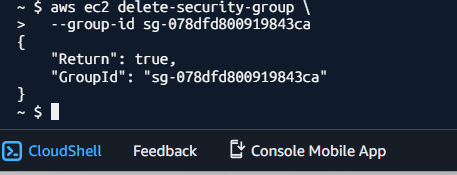

HW_6 — AWS Security Group (CLI + Console)

1. Создание Security Group через AWS CLI

aws ec2 create-security-group \
  --group-name 250425-ruslan-sg \
  --description "Security Group for MySQL and HTTPS and SSH"

Добавление inbound правил через AWS CLI

Порт 3306 (MySQL)

screenshots/aws ec2 authorize-security-group-ingress \

  --group-id sg-078dfd800919843ca \
  --protocol tcp \
  --port 3306 \
  --cidr 0.0.0.0/0 \
  --tag-specifications 'ResourceType=security-group-rule,Tags=[{Key=Name,Value=mysql}]'

screenshots/aws-cli-add-rule-3306-250425-ruslan.png

Порт 443 (HTTPS)
screenshots/aws ec2 authorize-security-group-ingress \

  --group-id sg-078dfd800919843ca \
  --protocol tcp \
  --port 443 \
  --cidr 0.0.0.0/0 \
  --tag-specifications 'ResourceType=security-group-rule,Tags=[{Key=Name,Value=https}]'

screenshots/aws-cli-add-rule-443-250425-ruslan.png

Добавление SSH (порт 22) через AWS Console

В AWS Management Console:

-Type → SSH
-Source → My IP
-Description → SSH My IP
Скриншот:
screenshots/sg-250425-ruslan-ssh-my-ip.png

Проверка правил через describe-security-groups

screenshots/aws ec2 describe-security-groups \

  --group-ids sg-078dfd800919843ca \
  --query 'SecurityGroups[*].IpPermissions' \
  --output json

Security Group

screenshots/aws ec2 delete-security-group \
  --group-id sg-078dfd800919843ca

screenshots/aws-cli-delete-sg-250425-ruslan.png

